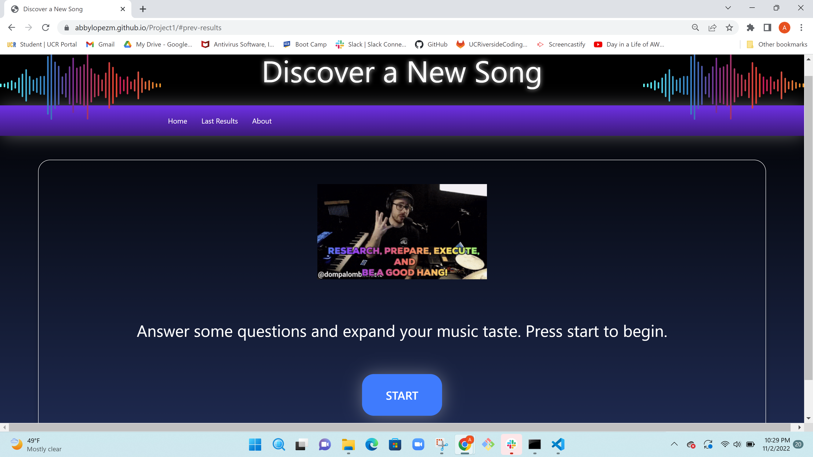
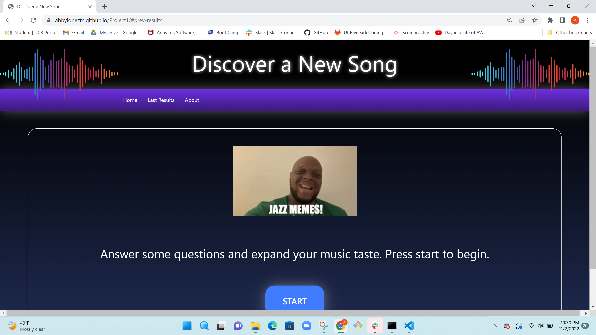
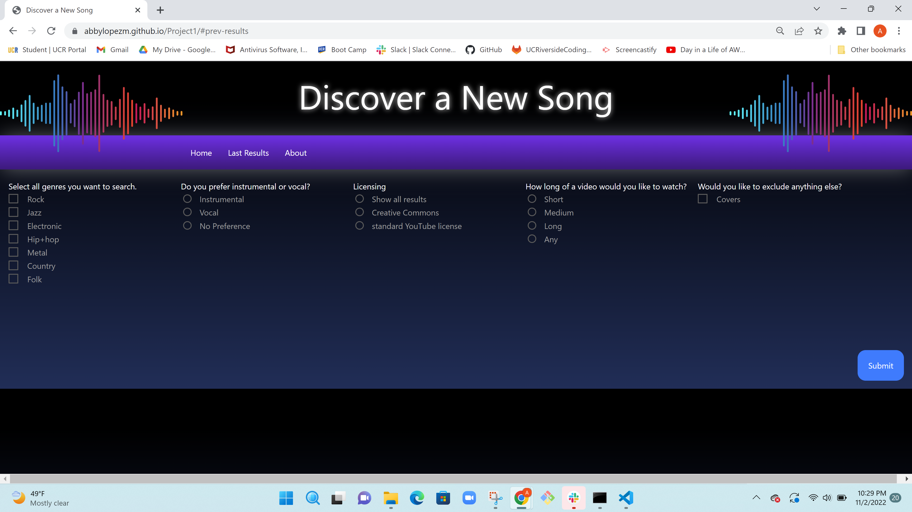
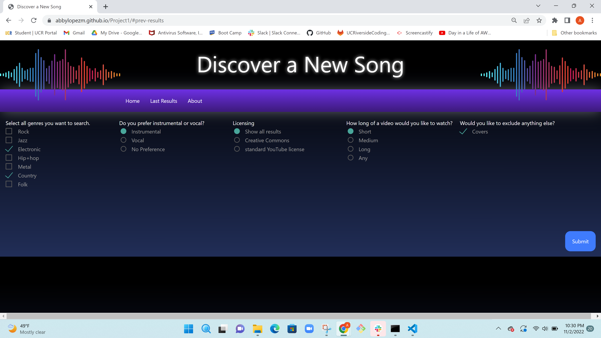
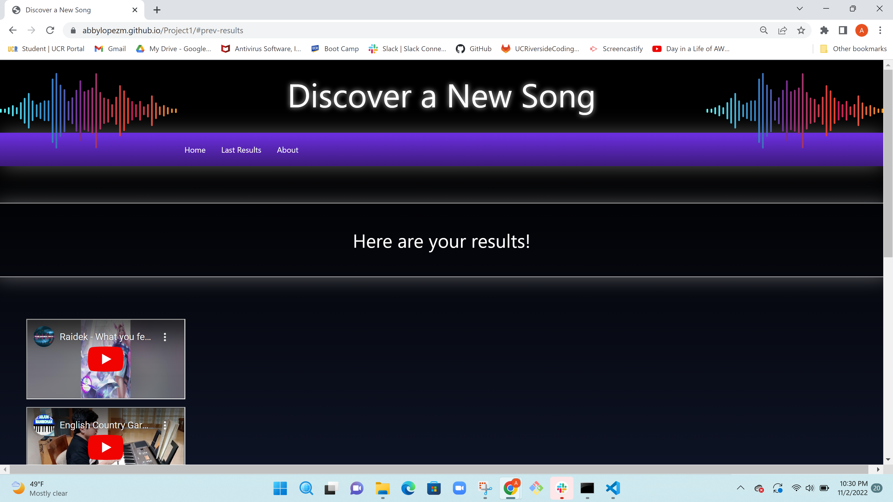
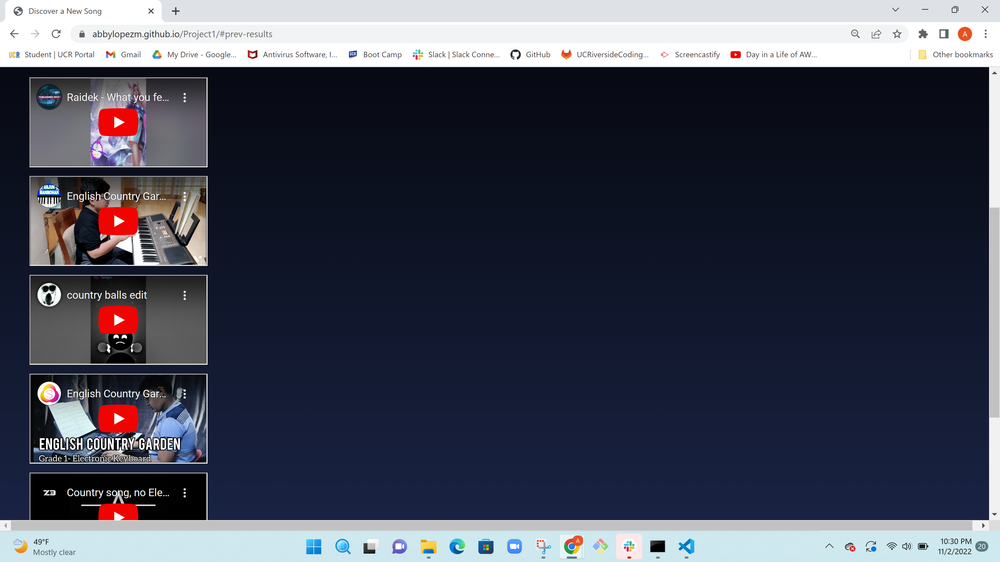
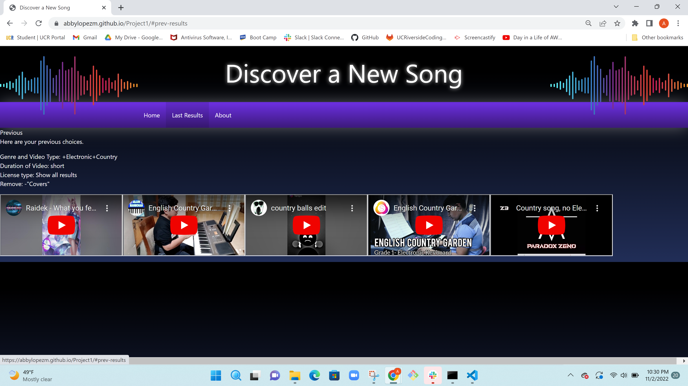
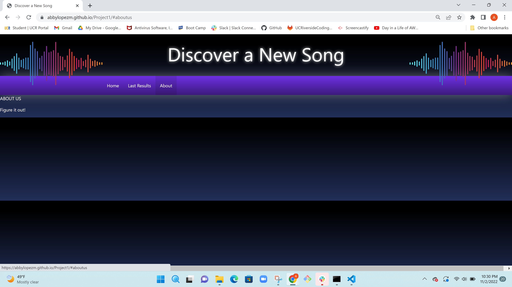

# Discover a New Song

Project 1

## Description

The motivation behind this project, was to let users explore different music.Sometimes we can get stuck listening to the same songs over and over, and the songs that used to feel exciting become stale. Even Spotify’s Discover Weekly, Apple Music’s New Music Mix, or other music apps will just regurgitate trending songs or songs you’ve heard before & your discovery page will get stuck in the same cycle - you like a song, the app will show you more songs from the same genre, you listen to them and like a few, the app shows you more of that same genre, and the cycle repeats. 
Of course, it is convenient for users to have music apps generate songs automatically, but we wanted to create a site that helps its users discover new music with autonomy in what they want from the next songs they listen to. We specifically sought out music with a fairly even ratio of likes to views, for reasons we will go more into depth later.

This project helped all contributors become better at working in teams and coding. We also increased our knowledge in the material that we have learned in the last couple months. 

## Table of Contents

If your README is long, add a table of contents to make it easy for users to find what they need.

- [Usage](#usage)
- [Credits](#credits)
- [License](#license)

## Usage

Here is the usage of the website:

## Credits

Collaborators:
Abby Lopez Martinez https://github.com/abbyLopezM
Kaylee Nguyen https://github.com/kn7767
Tyler Adams https://github.com/tyleradams2211
Elijah Miranda https://github.com/elijah-hajile

Third Party Assets: 
Materialize Framework

API:
Giphy API
	https://developers.giphy.com/docs/api/endpoint/
	https://www.youtube.com/watch?v=x9Vy-wmtYic
	
YouTube Search API
	https://developers.google.com/youtube/v3/docs/search/list
	
YouTube Video Statistics API
	https://developers.google.com/youtube/v3/docs/videos/list

Links:
Youtube Algorithm
	https://blog.hootsuite.com/how-the-youtube-algorithm-works/
	
Javascript
	https://www.w3schools.com/jsref/default.asp
	
API with JS
	https://developer.mozilla.org/en-US/docs/Web/API
	https://www.w3schools.com/jsref/api_console.asp
	

## License

MIT License

## Badges

## Features

Our project' feature is to search and sort music videos. Essentially it is like a Youtube Search+. 

## How to Contribute

In the future, other contributers can add other functionalities such as a randomizer for the genre if the user does not mind the selection of genres, or a text input for the user to create their own genre. Another functionality that they can add is to have the video results to play when the mouse hovers over the videos. Contributors might also consider adding to our API and add a functionality to be able to add a search by date on the video so that if the user wants to search an older video they can. hanging the API that we used and instead use the Spotify API to generate song recommendations this could make the sorting easier. Lastly, a goal would be to convert our website to a music app making it more user friendly for phone users. 

